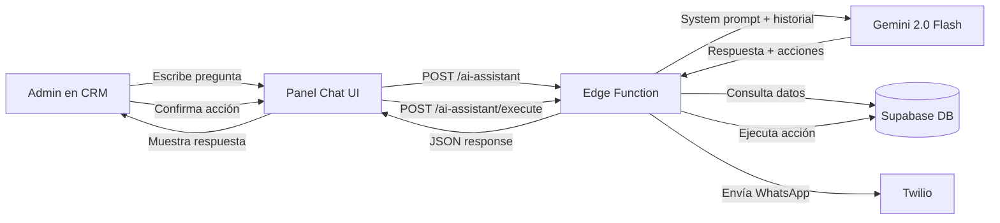

# Asistente IA para Carwash CRM — Diseño

> **Decisiones del brainstorming:**
> - **Enfoque:** Asistente conversacional en el dashboard
> - **LLM:** Google Gemini 2.0 Flash (gratis, 15 req/min)
> - **UI:** Panel lateral flotante (burbuja en todas las páginas)
> - **Capacidades:** Consultas + acciones con confirmación del admin

---

## Arquitectura General



**Flujo:**
1. El admin escribe en el chat flotante
2. El frontend envía la pregunta + contexto de página actual al Edge Function `ai-assistant`
3. El Edge Function consulta la DB para obtener datos relevantes, arma el prompt con contexto, y llama a Gemini
4. Gemini responde con texto + opcionalmente "acciones propuestas" en formato JSON
5. El frontend muestra la respuesta y, si hay acciones, botones de confirmación
6. El admin aprueba → el frontend llama al endpoint de ejecución

---

## Componentes a Crear

### 1. Edge Function: `ai-assistant`

El cerebro del sistema. Recibe la pregunta del admin y responde usando Gemini con contexto de la DB.

**Endpoint:** `POST /functions/v1/ai-assistant`

**Payload de entrada:**
```json
{
  "message": "¿Qué clientes no vienen hace más de 20 días?",
  "conversation_history": [...],
  "page_context": "ordenes"
}
```

**System prompt para Gemini:**
```
Sos el asistente IA de un lavadero de autos llamado "{business_name}".
Tu rol es ayudar al admin con: análisis de datos, seguimiento de clientes,
marketing por WhatsApp, y gestión operativa.

DATOS ACTUALES DEL NEGOCIO:
- Clientes totales: {total_clients}
- Órdenes hoy: {today_orders}
- Facturación del día: ${today_revenue}
- Clientes sin venir hace +{follow_up_days} días: {inactive_count}
- Stock bajo ({low_stock_items} items)

REGLAS:
- Respondé siempre en español argentino, amigable y conciso
- Si el admin pide enviar WhatsApp, generá la acción con formato JSON
- Si detectás una oportunidad de negocio, sugerila proactivamente
- No inventes datos. Usá solo los datos proporcionados
- Podés generar textos de marketing, promos, y mensajes personalizados

ACCIONES DISPONIBLES (incluir en el JSON de respuesta si corresponde):
- send_whatsapp: { client_ids: [], message: "..." }
- create_promotion: { discount: 20, service_id: "...", message: "..." }
- generate_report: { type: "weekly|daily|monthly" }
```

**Payload de respuesta:**
```json
{
  "response": "Encontré 3 clientes que no vienen hace más de 20 días:\n1. Juan Pérez (25 días) - Toyota Hilux\n2. ...",
  "actions": [
    {
      "type": "send_whatsapp",
      "label": "Enviar WhatsApp a 3 clientes",
      "description": "Mensaje de re-engagement personalizado",
      "params": {
        "clients": [
          { "id": "uuid1", "name": "Juan Pérez", "phone": "1155..." }
        ],
        "message": "¡Hola Juan! 👋 Hace 25 días que..."
      }
    }
  ]
}
```

**Lógica interna del Edge Function:**
1. Recibe `message` y `conversation_history`
2. Consulta la DB para datos de contexto (resumen rápido: clientes, órdenes, inventario)
3. Arma el system prompt con datos reales inyectados
4. Llama a Gemini API con el prompt + historial de conversación
5. Parsea la respuesta de Gemini (texto + posibles acciones JSON)
6. Retorna al frontend

**Ejecución de acciones:**
Un segundo endpoint `POST /functions/v1/ai-assistant` con `{ "execute_action": {...} }` que ejecuta la acción confirmada (enviar WhatsApp, etc.) reutilizando la lógica existente de `send-whatsapp`.

---

### 2. Componente Frontend: `AiChatPanel`

**Ubicación:** `src/components/ai/AiChatPanel.tsx`

**Subcomponentes:**
- `AiChatButton.tsx` — Burbuja flotante (esquina inferior derecha)
- `AiChatPanel.tsx` — Panel lateral deslizable con el chat
- `AiMessage.tsx` — Componente de mensaje (usuario/asistente)
- `AiActionCard.tsx` — Tarjeta de acción con botón "Confirmar"/"Cancelar"

**Diseño visual:**

| Elemento | Estilo |
|---|---|
| Burbuja | Círculo 56px, gradiente azul-violeta, ícono Bot, pulse suave |
| Panel | 400px ancho, altura completa, glass-morphism, slide-in desde derecha |
| Mensajes admin | Burbuja derecha, fondo primario |
| Mensajes IA | Burbuja izquierda, fondo muted, markdown renderizado |
| Acciones | Card especial con borde amber, botones Confirmar/Cancelar |
| Input | Fixed bottom, textarea + botón enviar |

**Estado:**
```tsx
const [isOpen, setIsOpen] = useState(false);
const [messages, setMessages] = useState<ChatMessage[]>([]);
const [isLoading, setIsLoading] = useState(false);
```

Los mensajes persisten en `localStorage` para no perder contexto entre navegaciones. Se resetean con un botón "Nueva conversación".

---

### 3. Tabla DB: `ai_conversations` (opcional, fase 2)

Para persistir conversaciones en el servidor y que Gemini tenga contexto histórico más largo. No es necesaria para el MVP — `localStorage` alcanza.

---

## Capacidades del Asistente — Ejemplos Concretos

| Pregunta del admin | El asistente hace |
|---|---|
| "¿Cómo estuvo el día?" | Consulta órdenes del día, calcula facturación, compara con promedio |
| "¿Qué clientes debería contactar?" | Busca clientes inactivos (>N días), muestra lista con acción WhatsApp |
| "Haceme una promo de fin de semana" | Genera texto de promo personalizado, ofrece enviarla por WhatsApp |
| "¿Hay algo que necesite atención?" | Revisa stock bajo, pagos pendientes, clientes VIP inactivos |
| "Mandá un recordatorio a María López" | Busca cliente, genera mensaje, muestra acción con confirmación |
| "¿Cuánto facturé esta semana?" | Suma `service_records` de la semana, compara con la anterior |
| "¿Quiénes son mis mejores clientes?" | Calcula frecuencia y gasto total, rankea top 10 |

---

## Secrets Necesarios

| Secret | Valor | Dónde |
|---|---|---|
| `GEMINI_API_KEY` | API key de Google AI Studio | Supabase Edge Function Secrets |

Se obtiene gratis en [aistudio.google.com](https://aistudio.google.com/apikey).

---

## Plan de Implementación (3 fases)

### Fase 1 — MVP funcional (lo que hacemos ahora)
- [ ] Edge Function `ai-assistant` con Gemini
- [ ] Componente `AiChatPanel` flotante
- [ ] Integración con datos reales (clientes, órdenes, inventario)
- [ ] Capacidad: consultas de datos (read-only)

### Fase 2 — Acciones con confirmación
- [ ] Acción: enviar WhatsApp individual/grupal
- [ ] Acción: generar y enviar promos
- [ ] `AiActionCard` con botones Confirmar/Cancelar
- [ ] Log de acciones ejecutadas en `notification_log`

### Fase 3 — Inteligencia avanzada
- [ ] Sugerencias proactivas ("Hoy es lunes, históricamente tu día más flojo")
- [ ] Persistencia de conversaciones en DB
- [ ] Reportes generados por IA (PDF/texto)
- [ ] Cron semanal que genera un resumen automático

---

## Verificación

### Pruebas manuales
1. Abrir el chat → enviar "Hola" → verificar respuesta coherente
2. Preguntar "¿cuántas órdenes hay hoy?" → verificar dato real
3. Pedir "contactar clientes inactivos" → verificar acción propuesta
4. Confirmar acción → verificar que el WhatsApp se envía
5. Revisar `notification_log` → verificar registro

### Pruebas de edge cases
- Enviar mensaje vacío → error amigable
- Gemini no responde (timeout) → mensaje de error en el chat
- Sin API key configurada → mensaje claro de configuración
